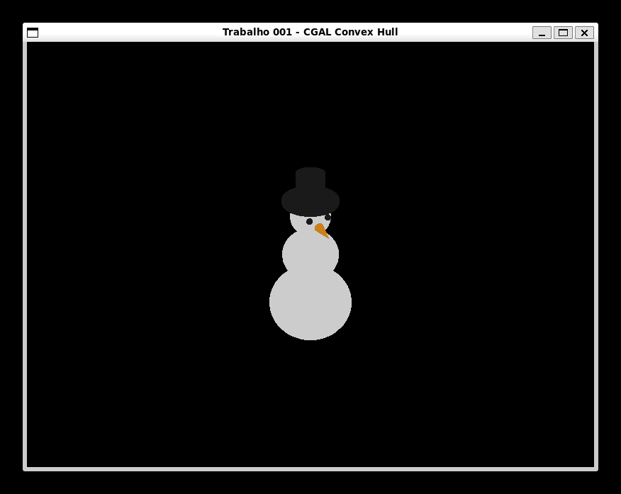
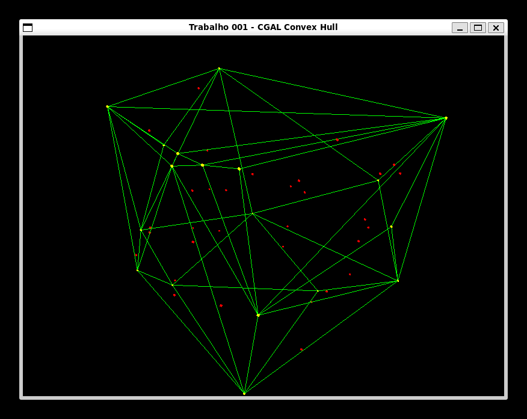
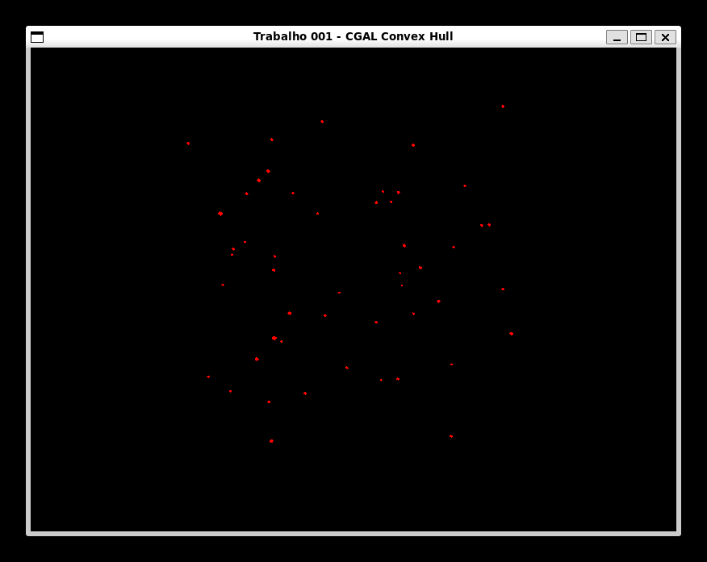
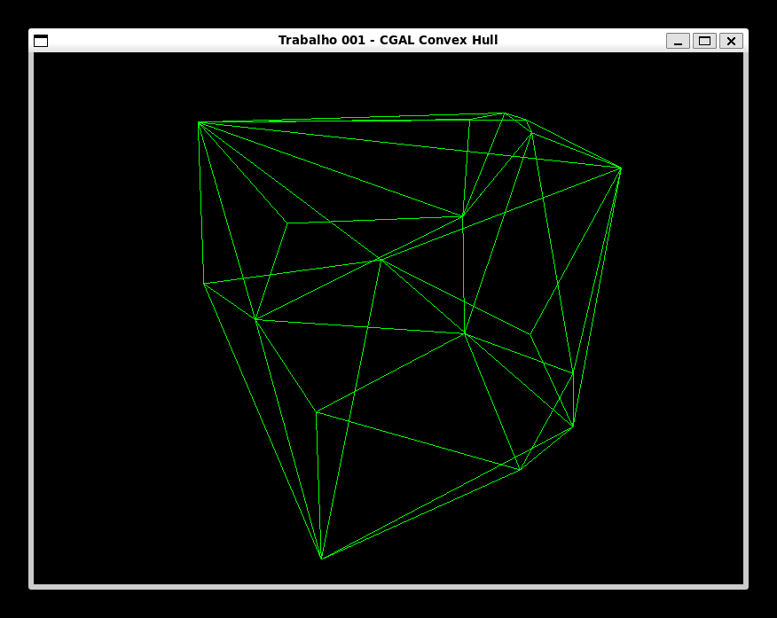
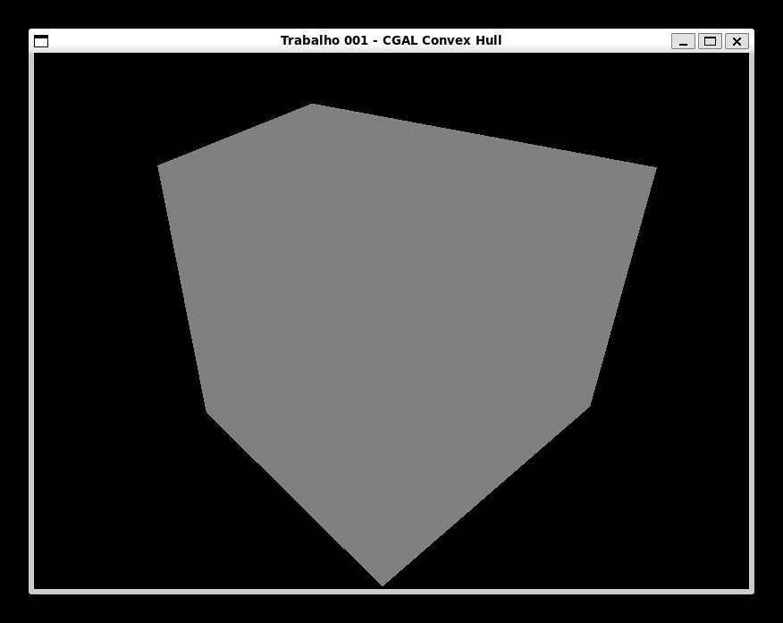
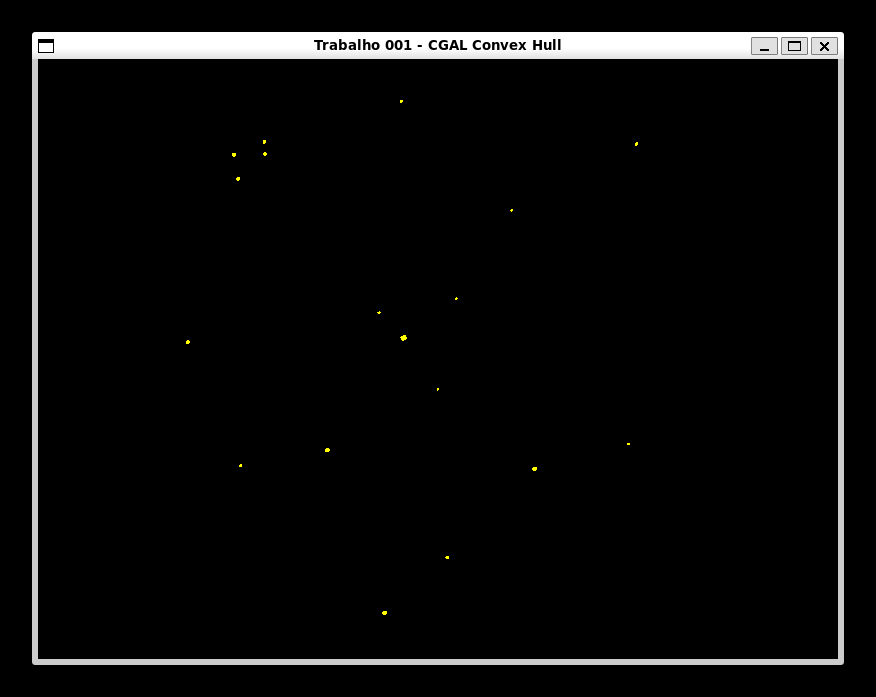
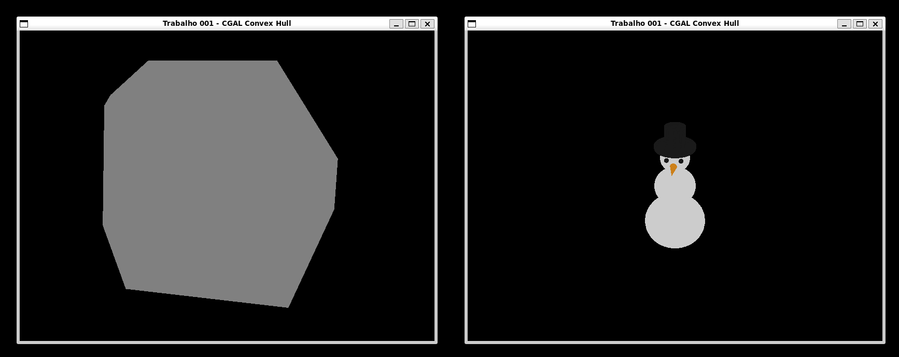

# Apresentação do Projeto: `convex_hull_3d`

## Visão Geral

`convex_hull_3d` é um projeto em C++ que demonstra o cálculo e a visualização de fechos convexos (convex hulls) em um ambiente 3D. Ele utiliza a biblioteca CGAL para a computação geométrica e SDL2 com OpenGL para a renderização gráfica interativa.

## Funcionalidades Principais

1. **Cálculo de Fecho Convexo**:
    * Capacidade de gerar um conjunto de pontos 3D aleatórios e calcular seu fecho convexo.
    * Carrega vértices de um arquivo de modelo 3D no formato `.obj`.
    * A lógica de cálculo é implementada em `convex_hull_compute.cpp` e utiliza a biblioteca **CGAL**.

2. **Modelos 3D**:
    * Modelo que lê um arquivo entrada.obj.
        * Lê o arquivo dentro da pasta assets/entrada.obj e pega apenas os vértices do modelo, retornando um array de pontos para cada objeto dentro do arquivo. Em cada objeto será feito o `Convex Hull` separadamente. O tema escolhido foi um Boneco de Neve.
        
    * Modelo gerado por cinquenta pontos aleatórios.
        * Gera 50 pontos aleatórios e aplica o algoritmo `Convex Hull` nestes pontos. Ideal para ver os pontos internos aos pontos gerados pelo `Convex Hull`.
        

3. **Visualização 3D Interativa**:
    * A aplicação cria uma janela usando **SDL2** e renderiza a cena 3D com **OpenGL**.
    * A câmera se move em uma trajetória circular ao redor da origem, permitindo a visualização do objeto de todos os ângulos.
    * O usuário pode controlar dinamicamente o que é exibido na tela através de teclas de atalho:
        * `P`: Alterna a exibição dos pontos originais.
        
        * `L`: Alterna a exibição das arestas (linhas) do fecho convexo.
        
        * `F`: Alterna a exibição das faces (polígonos) do fecho convexo.
        
        * `V`: Alterna a exibição dos vértices que compõem o fecho convexo.
        
        * `R`: Alterna entre a visualização do fecho convexo aleatório e o carregado do arquivo `.obj`.
        

## Estrutura do Projeto

O código-fonte está organizado da seguinte forma:

* `CMakeLists.txt`: Arquivo de build que define como o projeto é compilado. Ele localiza e vincula as dependências (`SDL2`, `OpenGL`, `CGAL`) e estrutura o executável final.
* `vcpkg.json`: Gerencia as dependências do projeto através do `vcpkg`, incluindo `sdl2`, `opengl`, `cgal`, `glm` e `imgui`.
* `app/`: Contém todo o código-fonte da aplicação.
  * `main.cpp`: Ponto de entrada da aplicação. É responsável por criar a janela, gerenciar o loop de eventos e orquestrar as chamadas para a lógica de cálculo e renderização.
  * `src/public/`: Interfaces públicas dos módulos da aplicação.
    * `convex_hull_compute.hpp`/`.cpp`: Funções que encapsulam a lógica de cálculo do fecho convexo com CGAL.
    * `window.hpp`/`.cpp`: Classe que abstrai a criação e gerenciamento da janela com SDL2.
    * `renderer.hpp`/`.cpp`: Classe responsável pela lógica de renderização com OpenGL (desenho de pontos, linhas, polígonos e esferas).
* `assets/`: Diretório para armazenar arquivos de mídia, como `entrada.obj`, que é o modelo 3D carregado pela aplicação.
* `script.py`: Um script Python auxiliar que simplifica tarefas comuns de desenvolvimento:
  * `clean`: Limpa o diretório de build.
  * `configure`: Executa o CMake para configurar o projeto.
  * `build`: Compila o código-fonte.
  * `run`: Executa a aplicação.
  * `build-run`: Compila e executa em um único comando.

## Como Compilar e Executar

O script `script.py` facilita o processo de build e execução.

1. **Pré-requisitos**:
    * CMake
    * Compilador C++
    * `vcpkg` com as dependências do `vcpkg.json` instaladas.
    * Python 3

2. **Compilar o projeto**:

    ```bash
    python3 script.py build
    ```

3. **Executar a aplicação**:

    ```bash
    python3 script.py run
    ```

## Dependências de código

* **CGAL (Computational Geometry Algorithms Library)**: A biblioteca principal para os algoritmos de geometria computacional.
* **SDL2**: Usada para criar a janela, o contexto OpenGL e para o tratamento de eventos de entrada (teclado).
* **OpenGL**: API gráfica utilizada para toda a renderização 3D.

## Ferramentas de Desenvolvimento

1. **VSCode**:
    * Editor de código.

2. **CMake**:
    * Sistema de build usado para gerenciar a compilação do projeto através do arquivo CMakeLists.txt, que define as dependências e o processo de build.

3. **VCPKG**:
    * Gerenciador de pacotes para C++. Gerencia as bibliotecas necessárias (SDL2, OpenGL, CGAL) através do arquivo vcpkg.json.
